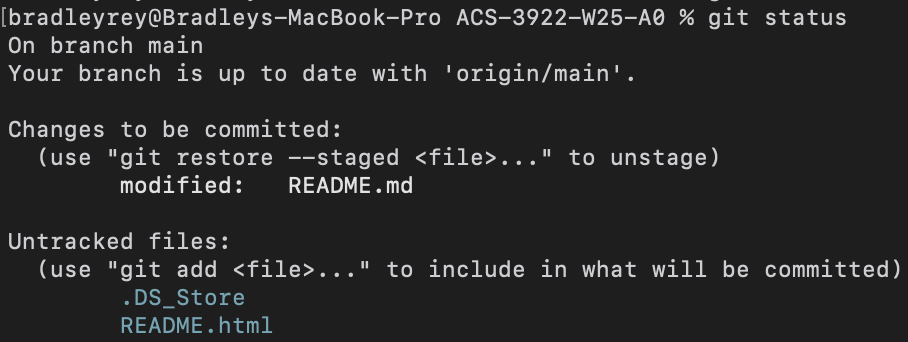
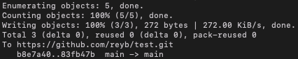

# ACS-3922-W25-A0
ACS-3922 W25 Assignment 0 is meant to provide you with experience using Git and Markdown. 

*This is assignment is not for marks and does not need to be completed.*

## Student Information
### Student Name:
### Student Number:

## Assignment Setup (Using a Command Line)

*The instructions below, assume that you have git installed on your machine and are signed into your Github account. For additional information on installing git please view the [Git Cheatsheet shared on Nexus](https://nexus.uwinnipeg.ca/d2l/le/content/67597/viewContent/1909269/View).*

1. To start working on the assignment, clone this repository to your local machine. To do that you should first copy the repository's web URL by clicking on Github's green ```Code``` button.
   
    
Then beside the dispalyed URL click the copy icon.

    
1. With the repository's web URL copied, you will next want to open up a 'command line interface' (Terminal on Mac or Command Prompt on Windows)
     - Use ```cd``` on both Windows or Linux/Mac to choose a directory (i.e., folder) that you would like to save the repository to locally. You will have to move through directories as they appear in your file explorer. For example:
  ```cd Documents/UW/ACS-3922/Assignments/A0```
          - If you are unsure about what folders/directories you have you can press Tab to view available options given your current working directory.
      - Once in a desired directory use the following git command to clone the remote repository to your local machine:
    ```git clone [insert the web url copied here without the square brackets]```
      - A few lines of output should appear (likely similar to what is shown below):

        
      - You now have a local copy of the repository from which you can work on. To verify this you should be able to graphically see these folders/files in your file explorer wherever you have cloned the repository!
          - **Note, at this point you are not actually in your git repository. Rather, it has been created in the directory you are currently in.** Use `cd [repository name without square brackets]` to move into the git repository.
          - You should also be able to view the repository's folders/files in your command line interface. Use ```dir /a:h``` on Windows or ```ls -a``` on Linux/Mac machines to see the files within your directory.
  
        
      - Once the above is complete, you can open a desired file in your editor of choice to begin working on it.

## Completing the Assignment (Using a Command Line)

### Edit Desired Files
1. Add your name and student number to the top of this README.md file (do this through by opening the file in an IDE such as Visual Studio Code), save the file as you would in your editor.
  
### Add, Commit, and Push Files
1. To commit files you should first, however, add the file to your next commit (stage): ```git add README.md```
    - This step allows you to choose which files that you've edited will later be commited, and lets you keep certain files/changes not commited if desired.
2. With the new README added (also known as *staged*), you can optionally first check which files have been added for your next commit: ```git status```

    
3. Now, commit the file/changes to the repository by using:
```git commit -m "Updated README given assignment instructions"```. Note a few things:
    - ```-m``` is a flag that lets us include a message (i.e., a description of what the commit is)
    - The message at the end should have quotes and should be short and succinct
    - Once you enter in the commit message, output will appear that highlights how many files were changed, insertions, and deletions.
    - At this point, you have saved a *snapshot* of the new status/version of your files. **Notice, however, if you go to Github online you will not yet see these changes. That's becuase you have only saved a snapshot/committed to your local repository.**
4. To have the changes appear in the remote (online) repository, you need to now use the ```push``` command, specifically you should use: ```git push```.
    - Once you have done this, you should see similar output to the following:
  
5. *Congratulations!* 🎉 You have now used Git to take a snapshot of your file changes and then to also push those changes to a remote repository!
    - You can go to github online to view your changes in the repository. *Note, you may need to refresh the page to see the changes.*

**Note: If you do not do the initial clone step (as described above), and instead choose to download a .zip file from Github**, which you then put inside a local git repository:
  - You will need to connect the git repository to a remote (online) repository before pushing. You can do this through the `git remote add origin [insert the web url (as described above) copied here without the square brackets]` command.

**Note, this this tutorial only scratches the surface of what Git can do! For this course, the above should suffice. For future, I highly recommend [exploring other Git features](https://docs.github.com/en/get-started/using-git/about-git).**

## Assignment Setup (Using a Github Desktop)
*Github Desktop offers a GUI (graphical user interface) to accomplish the desired file tracking. It is an application which you can [download online](https://github.com/apps/desktop). The instructions below assume that you have Github Desktop downloaded.*

*Note, you will need/want to sign in to your Github account to use Github Desktop.*

1. To start working on the assignment, clone this repository to your local machine. To do that you should first copy the repository's web URL by clicking on Github's green ```Code``` button.
   
    
Then beside the dispalyed URL click the copy icon.

    

2. With the repository's web URL copied, you will next want to open up Github Desktop.

    - Click on `Clone a Repository from the Internet`. 
      - If you are logged in to your Github account you can use this to see your repositories, otherwise select `URL`. Paste in the copied URL and click `Clone`.
    

3. You should now be brought to a *home screen* for the repository and are ready to work on the assignment!


## Completing the Assignment (Using Github Desktop)

### Edit Desired Files
1. Add your name and student number to the top of this README.md file (do this by opening the file in an IDE such as Visual Studio Code), save the file as you would in your editor.
    - Github Desktop even offers some quick options for opening files in an IDE (as seen in the above images).

### Add, Commit, and Push Files
Once you have edited your files, Github Desktop should visually update to show that there are changes made in the local repository.


1. Adding files to be commited in Github Desktop is done implicitly for you (*rather than in a command line where you have to explicitly state the files to add*). 
    - Any changes are considered added (*also called staged*) to be commited.
      - This can be seen by the blue check marks that are to the left of each file name in the Changes tab (on the left of the Github Desktop window).
    - Note, you can still choose to *not* add files to a commit.
      - This can be done by unchecking files. This step allows you to choose which files that you've edited will later be commited, and lets you keep certain files/changes not commited if desired.

2. Now, commit the file/changes to the repository by clicking `Commit to main` at the bottom left.
    - You will want to add a description in the `Description` box just above the button. This should be short and succinct.
    - Once clicked, you have saved a *snapshot* of the new status/version of your files. **Notice, however, if you go to Github online you will not yet see these changes. That's becuase you have only saved a snapshot/committed to your local repository.**
    - Once clicked, you should see something similar to the following:


3. To have the changes appear in the remote (online) repository, you need to now use the `Push origin` button highlighted in the main part of the screen.
    - If this does not appear you can also use `Ctrl+P` on Windows or `Cmd+P` on Mac. Furthermore, you can go to `Repository` in the menu bar and select `Push`.
    - *There unfortunately is minimal feedback at this stage to let you know that the push operation was successful.*

4. *Congratulations!* 🎉 You have now used Git to take a snapshot of your file changes and then to also push those changes to a remote repository!
    - You can go to github online to view your changes in the repository. *Note, you may need to refresh the page to see the changes.*

**Note, this this tutorial only scratches the surface of what Git can do! For this course, the above should suffice. For future, I highly recommend [exploring other Git features](https://docs.github.com/en/get-started/using-git/about-git).**